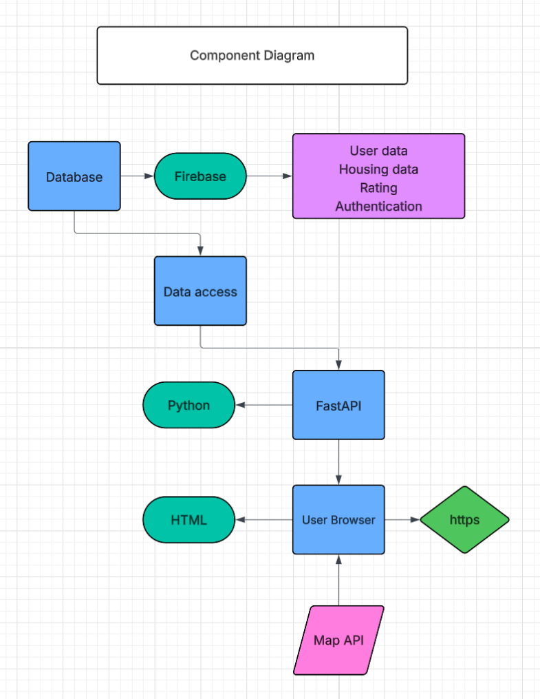
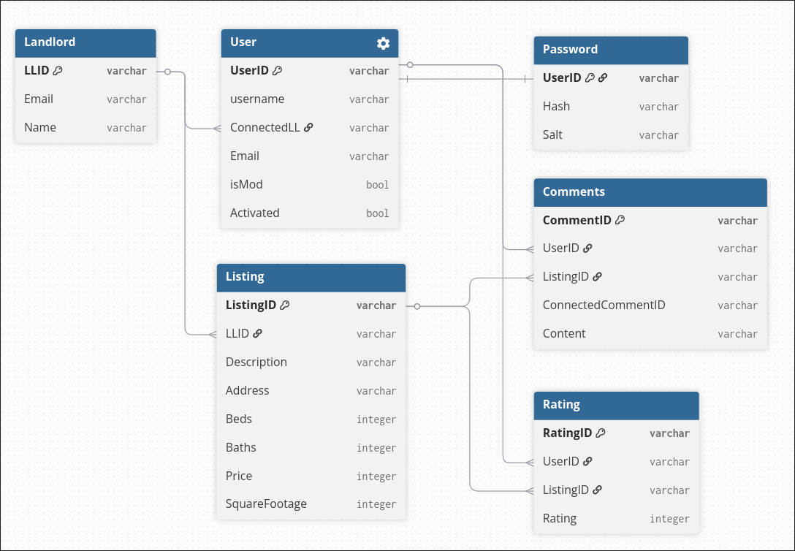

# RateMyHousing
Created by Jonah Barnett, Aaron Brey, Kent Manion, and Andew Stappenbeck

## Discription
This system is a piece of software that manages Case Western Reserve University housing information and interactions with that information from the landlord and student point of view. Its primary purpose is to connect CWRU students with good housing options by providing key information about each housing option from both an objective and subjective point of view. Combining key base information like amenities and location with student provided experience via comments and individual ratings, the system will compile all the information on a plethora of housing options across the campus. Additionally, landlords can augment this housing basis in order to put their property into the system too. From there, this information will be sorted by the system and presented to users in an effective way that allows them to see and interact with housing options across CWRU, gaining information and insight into housing options and making the CWRU housing process more smooth and efficient for students.


## Architecture overview





## Tech stack

All of our data is storred in a firebase datastore

And we use the following python libraries to run our entire project:

fastapi, uvicorn, python-multipart, jinja2, firebase-admin, google-cloud-firestore, protobuf, tzdata, pytest, coverage

## Instelation 

0. Set up Secrets.json and Secrets2.json 

Secrets.json is set up via first making a firebase project make a datastore. Then make a Firebase Admin SDK Private key. Rename the file this gives you and put it in /src as Secrets.json

for Secrets2.json
Generate an app password for your gmail.com account
make the file with the following outline

{

    "Sender": "Your_Email.com",
    
    "Password":"ThePasswordItGivesYou"
    
}

Additionally, replace the key on line 307 of `listing.html` with your own MapBox API key

1. Set up python venv and activate it

'''sh
python -m venv .venv
source .venv/bin/activate
'''

2. Download all libraries

'''sh
pip install -r requirements.txt
'''

3. Start the server

```sh
uvicorn web:app --reload
```

4. go to website it setups

## Usage example 

The user interacts with the machine (re-write this)

## Repository structure

/src

Holds all of the non-active python source code.

/static

Holds the universal style file for the front end

/templates

Holds every single html file

web.py

All of the logic that directly interacts with the website

test_web.py

Tests the web.py function using mock objects

## Team Contributions

Jonah Barnett: API Integration (i.e. Map), User Groups 

Aaron Brey: Database Caretaker, Cache Manager, Backend Superstar

Kent Manion: Front End Development

Andew Stappenbeck: Backend, Testing, User Groups

## Lessons Learned

nothin


## AI usage:

Tests: test_rating_relations, test_comment_relations, test_listing_relations, and test_landlord_relations 

Were completly generated by gemini after strict prompting and fully making by hand test_user_relations as a template
